# SocketPipe Protocol Specification

> **⚠️ Superseded.** This protocol has been replaced by [VROOM-Terminal](https://github.com/deftai/vroom/blob/main/VROOM-Terminal.md), and the underlying OpenMUX transport work has moved to [xumux.org](https://xumux.org). This repository is kept for historical reference only; new work should target VROOM-Terminal over xumux.

**Version**: 1.0.0-draft  
**Status**: Draft (superseded)  
**Date**: 2026-02-09

SocketPipe is an open protocol for transporting terminal I/O between web-based clients and backend services over WebSocket connections.

## Table of Contents

- [Overview](#overview)
- [Architecture](#architecture)
- [Transport](#transport)
- [Protocol](#protocol)
  - [Frame Format](#frame-format)
  - [Message Types](#message-types)
  - [Handshake](#handshake)
  - [Data Transfer](#data-transfer)
  - [Control Messages](#control-messages)
  - [Keepalive](#keepalive)
  - [Session Management](#session-management)
  - [Error Handling](#error-handling)
- [Security](#security)
- [Examples](#examples)
- [Future Extensions](#future-extensions)

---

## Overview

SocketPipe standardizes how web-based terminal clients (such as xterm.js or ghostty-wasm) communicate with backend services through proxy servers. It supports two operational modes:

- **Tunnel Mode**: Raw TCP passthrough for already-encrypted protocols (e.g., SSH)
- **PTY Mode**: Terminated connections with plaintext terminal I/O

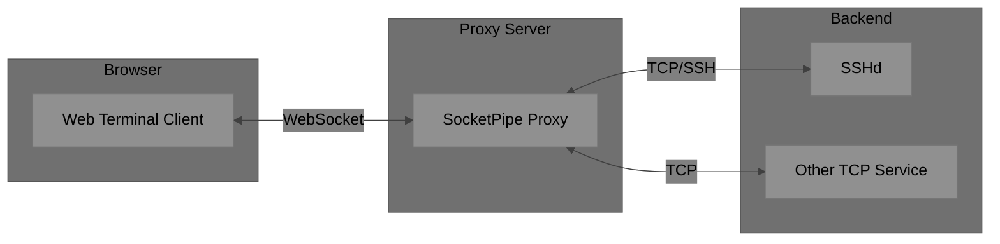

### Design Goals

- **Interoperability**: Any compliant client works with any compliant server
- **Efficiency**: Minimal overhead binary framing for real-time terminal interaction
- **Security**: Clear security boundaries with mode-appropriate encryption requirements
- **Simplicity**: Easy to implement in any language

### Non-Goals

- Client UI implementation
- Server-side credential storage
- Logging/audit format specification

---

## Architecture

### Operational Modes

SocketPipe supports two distinct modes, each exposed on a separate endpoint:

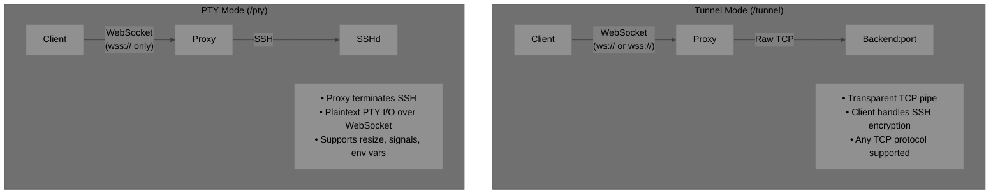

### Mode Comparison

| Aspect | Tunnel Mode (`/tunnel`) | PTY Mode (`/pty`) |
| --- | --- | --- |
| Data | Encrypted SSH bytes | Plaintext terminal I/O |
| TLS | Optional | **Required** |
| Backend | Any TCP service | SSH only |
| Client responsibility | Full SSH handling | Terminal emulation only |
| Use case | SSH client in browser | Simple terminal access |

---

## Transport

### Requirements

- **WebSocket**: MUST be the primary transport
- **Binary frames**: MUST use binary WebSocket frames (opcode 0x02)
- **Byte order**: MUST use big-endian (network byte order) for multi-byte fields

### Endpoints

| Endpoint | TLS Requirement | Description |
| --- | --- | --- |
| `/tunnel` | MAY use `ws://` or `wss://` | Raw TCP tunnel |
| `/pty` | MUST use `wss://` only | Terminated SSH with PTY |

---

## Protocol

### Connection Lifecycle

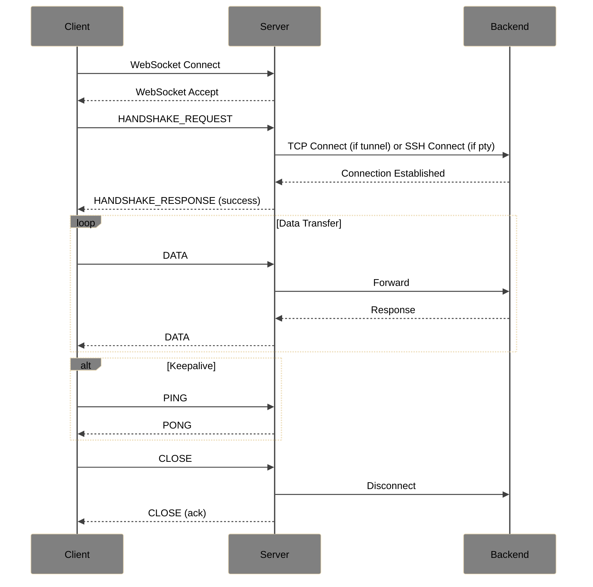

### Frame Format

All messages use an 8-byte header followed by an optional payload:

```
 0                   1                   2                   3
 0 1 2 3 4 5 6 7 8 9 0 1 2 3 4 5 6 7 8 9 0 1 2 3 4 5 6 7 8 9 0 1
+-+-+-+-+-+-+-+-+-+-+-+-+-+-+-+-+-+-+-+-+-+-+-+-+-+-+-+-+-+-+-+-+
|     Type      |     Flags     |           Reserved            |
+-+-+-+-+-+-+-+-+-+-+-+-+-+-+-+-+-+-+-+-+-+-+-+-+-+-+-+-+-+-+-+-+
|                         Payload Length                        |
+-+-+-+-+-+-+-+-+-+-+-+-+-+-+-+-+-+-+-+-+-+-+-+-+-+-+-+-+-+-+-+-+
|                         Payload (variable)                  ...
+-+-+-+-+-+-+-+-+-+-+-+-+-+-+-+-+-+-+-+-+-+-+-+-+-+-+-+-+-+-+-+-+
```

| Offset | Field | Size | Description |
| --- | --- | --- | --- |
| 0 | Type | 1 byte | Message type identifier |
| 1 | Flags | 1 byte | Message-specific flags |
| 2 | Reserved | 2 bytes | MUST be `0x0000` |
| 4 | Payload Length | 4 bytes | Payload size in bytes |
| 8 | Payload | variable | Message-specific data |

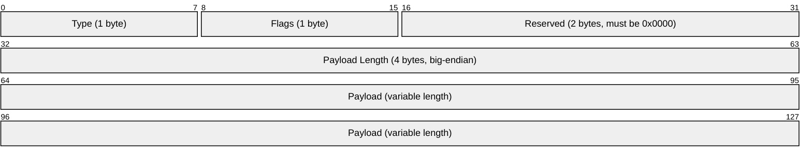

### Message Types

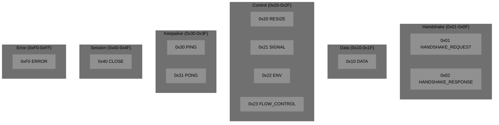

| Type | Name | Direction | Support | Description |
| --- | --- | --- | --- | --- |
| `0x01` | HANDSHAKE_REQUEST | C→S | MUST | Client initiates connection |
| `0x02` | HANDSHAKE_RESPONSE | S→C | MUST | Server accepts/rejects |
| `0x10` | DATA | Both | MUST | Terminal/tunnel data |
| `0x20` | RESIZE | C→S | MUST | Terminal resize (PTY only) |
| `0x21` | SIGNAL | C→S | SHOULD | Send signal (PTY only) |
| `0x22` | ENV | C→S | SHOULD | Set env var (PTY only) |
| `0x23` | FLOW_CONTROL | Both | SHOULD | XON/XOFF |
| `0x30` | PING | Both | MUST | Keepalive request |
| `0x31` | PONG | Both | MUST | Keepalive response |
| `0x40` | CLOSE | Both | MUST | Graceful close |
| `0xF0` | ERROR | S→C | MUST | Error notification |

---

### Handshake

The handshake MUST be the first exchange after WebSocket connection establishment.

#### HANDSHAKE_REQUEST (0x01)

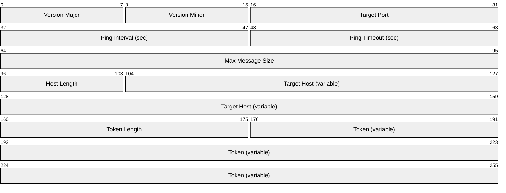

| Field | Size | Description |
| --- | --- | --- |
| Version Major | 1 byte | Protocol major version (current: `1`) |
| Version Minor | 1 byte | Protocol minor version (current: `0`) |
| Target Port | 2 bytes | Backend port number |
| Ping Interval | 2 bytes | Requested ping interval (0 = default) |
| Ping Timeout | 2 bytes | Requested ping timeout (0 = default) |
| Max Message Size | 4 bytes | Requested max size (0 = default) |
| Host Length | 1 byte | Length of hostname |
| Target Host | variable | Hostname or IP (UTF-8) |
| Token Length | 2 bytes | Length of auth token |
| Token | variable | Authentication token |

**Negotiable Parameters & Defaults**:

| Parameter | Default | Description |
| --- | --- | --- |
| Ping Interval | 30 seconds | How often to send PING |
| Ping Timeout | 10 seconds | How long to wait for PONG |
| Max Message Size | 65536 bytes | Maximum DATA payload size |

#### HANDSHAKE_RESPONSE (0x02)

**Flags**:
- Bit 0: `1` = Success, `0` = Failure

**Success Payload**:

| Field | Size | Description |
| --- | --- | --- |
| Version Major | 1 byte | Server's protocol version |
| Version Minor | 1 byte | Server's protocol version |
| Ping Interval | 2 bytes | Negotiated interval |
| Ping Timeout | 2 bytes | Negotiated timeout |
| Max Message Size | 4 bytes | Negotiated max size |

**Failure Payload**:

| Field | Size | Description |
| --- | --- | --- |
| Error Code | 2 bytes | Error code |
| Message Length | 1 byte | Length of message |
| Message | variable | Human-readable error (UTF-8) |

#### Handshake State Machine

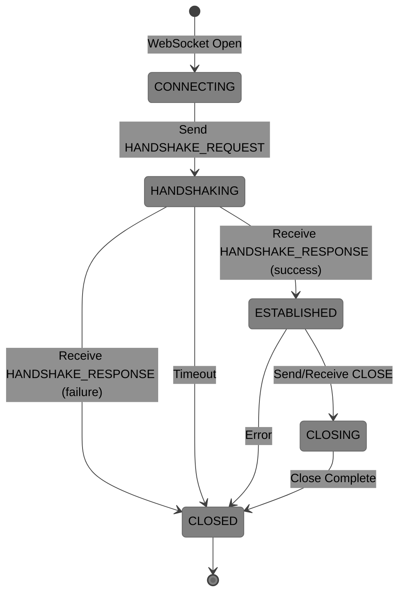

---

### Data Transfer

#### DATA (0x10)

Carries terminal I/O (PTY mode) or raw TCP bytes (tunnel mode).

**Payload**: Raw bytes to forward. No additional framing.

**Constraints**:
- MUST NOT exceed negotiated Max Message Size
- No minimum size (empty DATA is valid but not useful)

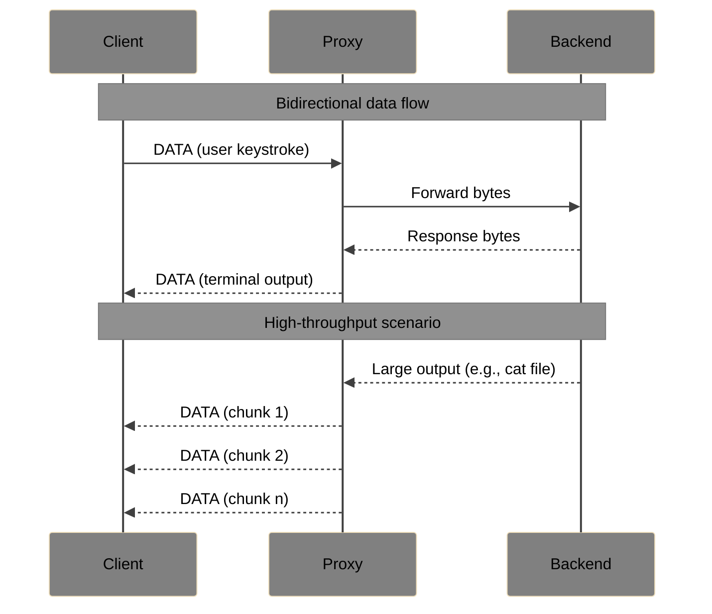

---

### Control Messages

Control messages are used for PTY-specific functionality. They MAY be ignored in tunnel mode.

#### RESIZE (0x20) — MUST support

Notifies server of terminal dimension change.

| Field | Size | Description |
| --- | --- | --- |
| Columns | 2 bytes | Terminal width in characters |
| Rows | 2 bytes | Terminal height in characters |
| Pixel Width | 2 bytes | Terminal width in pixels (0 if unknown) |
| Pixel Height | 2 bytes | Terminal height in pixels (0 if unknown) |

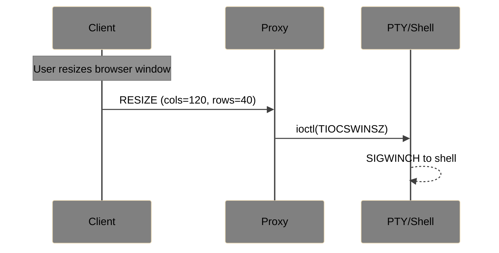

#### SIGNAL (0x21) — SHOULD support

Sends a signal to the PTY process.

| Field | Size | Description |
| --- | --- | --- |
| Signal | 1 byte | Signal identifier |

| Value | Signal | Typical Use |
| --- | --- | --- |
| `0x01` | SIGINT | Ctrl+C |
| `0x02` | SIGTERM | Graceful termination |
| `0x03` | SIGHUP | Hangup |
| `0x04` | SIGKILL | Force kill |

#### ENV (0x22) — SHOULD support

Sets an environment variable. MUST be sent before the first DATA message.

| Field | Size | Description |
| --- | --- | --- |
| Name Length | 1 byte | Length of variable name |
| Name | variable | Variable name (UTF-8) |
| Value Length | 2 bytes | Length of value |
| Value | variable | Variable value (UTF-8) |

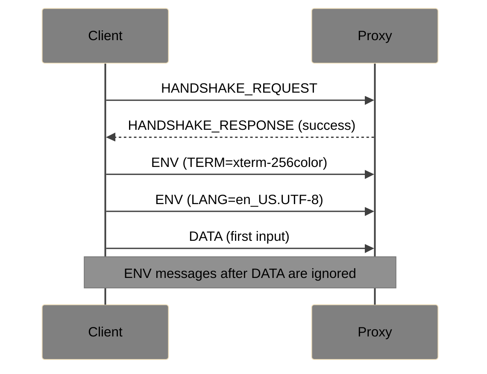

#### FLOW_CONTROL (0x23) — SHOULD support

XON/XOFF flow control signaling.

**Flags**:
- Bit 0: `1` = XON (resume), `0` = XOFF (pause)

**Payload**: Empty.

---

### Keepalive

Keepalive ensures connection liveness and detects stale connections.

#### PING (0x30)

Either side MAY send PING at any time.

**Payload**: Optional opaque data (up to 125 bytes recommended).

#### PONG (0x31)

Response to PING.

**Payload**: MUST echo the PING payload exactly.

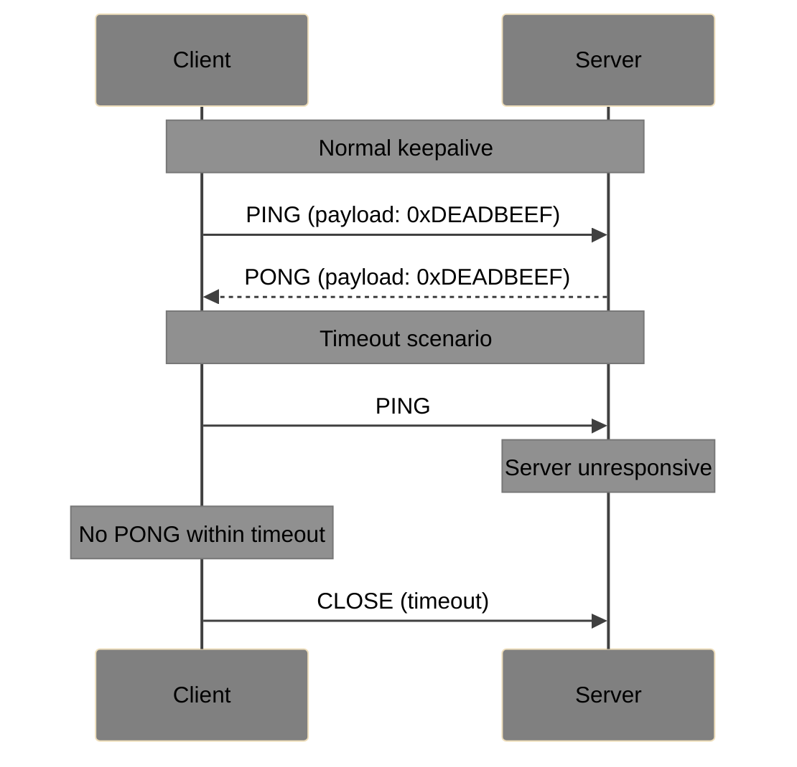

**Requirements**:
- MUST respond to PING with PONG within negotiated timeout
- SHOULD send PING at negotiated interval when idle
- SHOULD close connection if PONG not received within timeout

---

### Session Management

#### CLOSE (0x40)

Initiates graceful connection close.

**Flags**:
- Bit 0: `1` = Client-initiated, `0` = Server-initiated

**Payload**:

| Field | Size | Description |
| --- | --- | --- |
| Reason Code | 2 bytes | Close reason |
| Message Length | 1 byte | Length of message |
| Message | variable | Human-readable reason (UTF-8) |

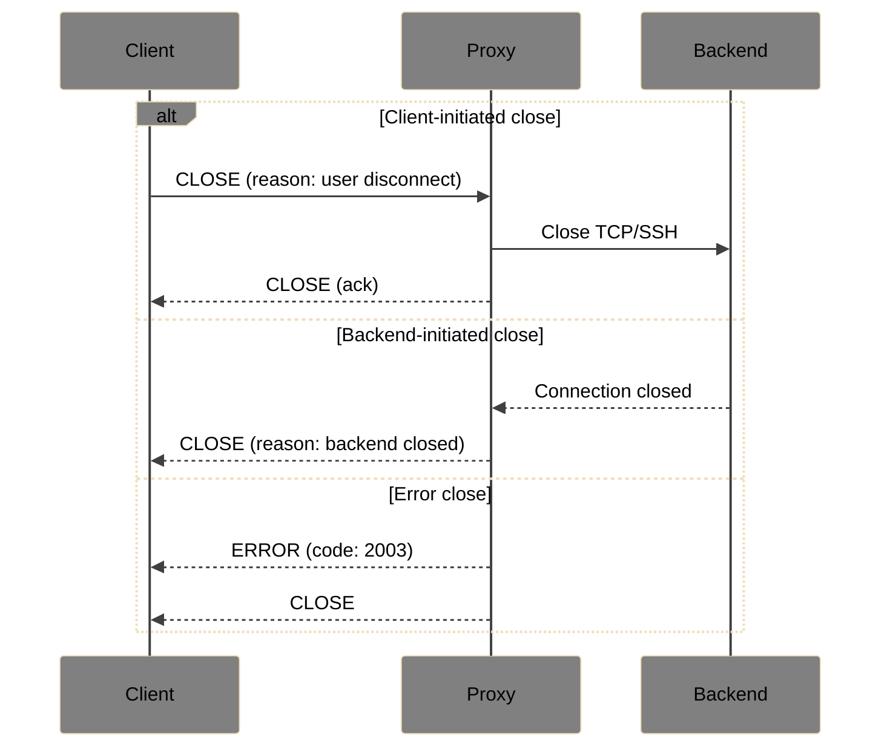

---

### Error Handling

#### ERROR (0xF0)

Server reports an error condition.

**Payload**:

| Field | Size | Description |
| --- | --- | --- |
| Error Code | 2 bytes | Error code |
| Message Length | 1 byte | Length of message |
| Message | variable | Human-readable error (UTF-8) |

#### Error Codes

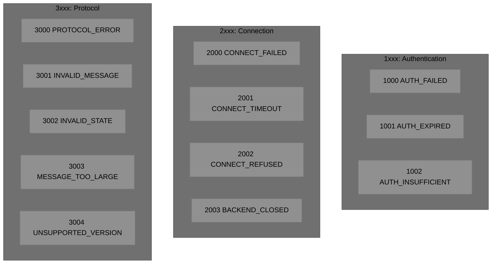

| Code | Name | Description |
| --- | --- | --- |
| 1000 | AUTH_FAILED | Token validation failed |
| 1001 | AUTH_EXPIRED | Token has expired |
| 1002 | AUTH_INSUFFICIENT | Token lacks required permissions |
| 2000 | CONNECT_FAILED | Failed to connect to backend |
| 2001 | CONNECT_TIMEOUT | Backend connection timed out |
| 2002 | CONNECT_REFUSED | Backend refused connection |
| 2003 | BACKEND_CLOSED | Backend closed connection |
| 3000 | PROTOCOL_ERROR | Generic protocol violation |
| 3001 | INVALID_MESSAGE | Malformed message |
| 3002 | INVALID_STATE | Message invalid in current state |
| 3003 | MESSAGE_TOO_LARGE | Message exceeds max size |
| 3004 | UNSUPPORTED_VERSION | Protocol version not supported |

---

## Security

### Authentication

- Clients MUST present a token in HANDSHAKE_REQUEST
- Servers MUST validate tokens before establishing backend connections
- Token format (JWT, opaque, etc.) is implementation-defined

### Transport Security

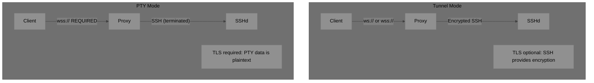

| Mode | Client to Proxy | Proxy to Backend | Rationale |
| --- | --- | --- | --- |
| Tunnel | TLS optional | Encrypted (SSH) | SSH provides end-to-end encryption |
| PTY | TLS **required** | SSH | Plaintext terminal data needs protection |

### Recommendations

- SHOULD use allowlists for permitted backend hosts/ports
- SHOULD implement rate limiting on connection attempts
- SHOULD log authentication failures
- MAY implement IP-based access controls

---

## Examples

### Tunnel Mode: SSH Connection

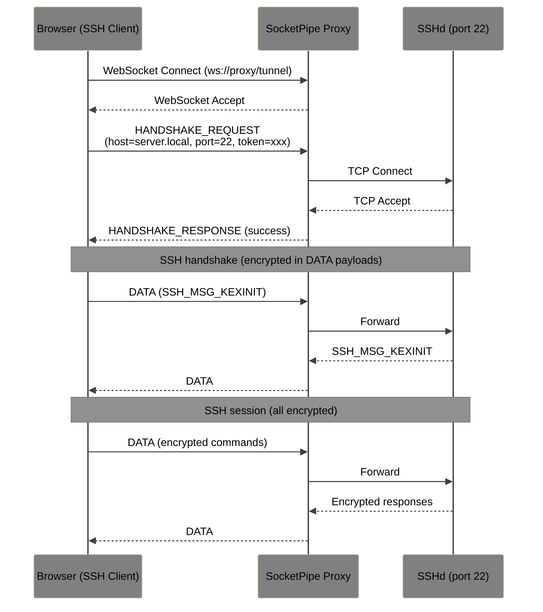

### PTY Mode: Terminal Session

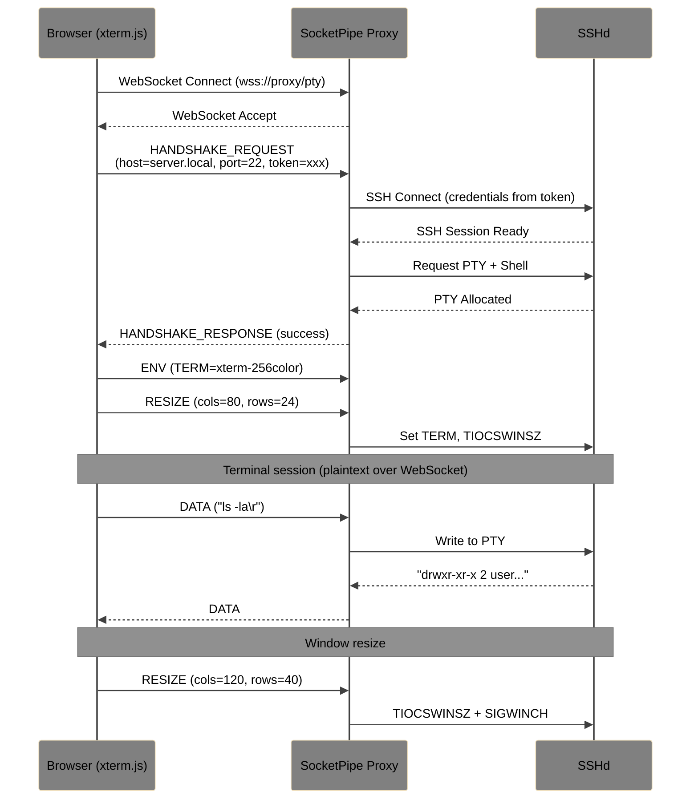

---

## Future Extensions

The following extensions are specified as separate documents:

| Extension | Status | Description |
| --- | --- | --- |
| [Session Resume](docs/ext-session-resume.md) | Draft | Reconnect after network disruption with session ID |
| [Session Persistence](docs/ext-session-persistence.md) | Draft | Long-lived sessions surviving client disconnect |
| [WebRTC Transport](docs/ext-webrtc-transport.md) | Draft | Data channels for lower latency |
| [Multiplexing](docs/ext-multiplexing.md) | Draft | Multiple logical sessions over single connection |
| [File Transfer](docs/ext-file-transfer.md) | Draft | SCP/SFTP support |
| [Port Forwarding](docs/ext-port-forwarding.md) | Draft | SSH port forwarding tunnels |

---

## References

- [RFC 6455](https://datatracker.ietf.org/doc/html/rfc6455) — The WebSocket Protocol
- [RFC 4254](https://datatracker.ietf.org/doc/html/rfc4254) — SSH Connection Protocol
- [RFC 2119](https://datatracker.ietf.org/doc/html/rfc2119) — Key words for use in RFCs

---

## License

This specification is released under [CC BY 4.0](https://creativecommons.org/licenses/by/4.0/).

---

## Contributing

Contributions welcome. Please open an issue or pull request.
